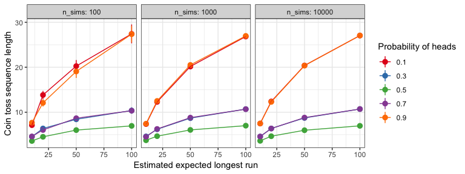

The Longest Run in a Coin Toss Sequence
================
Charlotte Wickham

Introduction
------------

A random sequence of H's and T's is generated by tossing a fair coin *n* = 20 times. What's the expected length of the longest run of consecutive heads or tails?

*Taken from Tijms, Henk. Probability: A Lively Introduction. Cambridge University Press, 2017*

-   How does the expected length of the longest run vary with the number of coinflips, *n*?

-   How does the answer change if the coin isn't fair?

-   How does the variance of our estimate vary with the number of simulations we do?

A simulation study was conducted to explore the answers to these questions ... blah blah

Results
-------

Unsurprising the longer the coin toss sequence the longest the expected longest run ... blah blah
